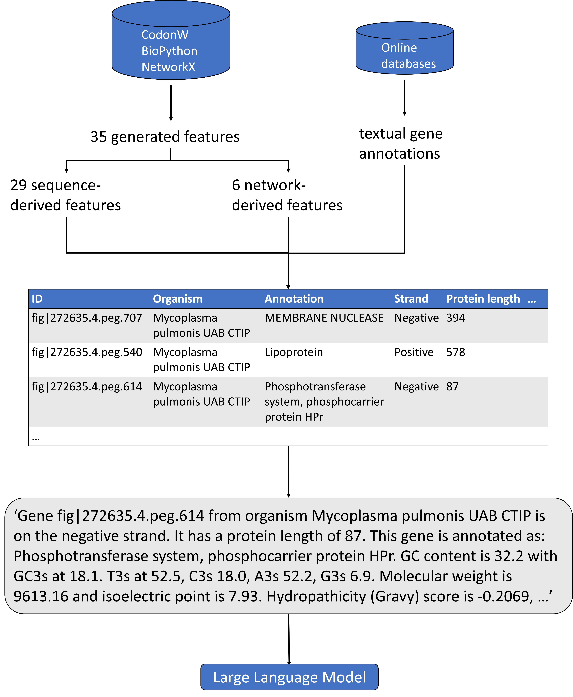

# Essential Genes LLMs
A transformer-based model for gene essentiality prediction that leverages textual gene annotation data as well as intrinsic sequence-derived features to learn essentiality signals.

 

## Reference
- To be added when published

Please cite this paper if you find our work useful.

## Description
This repository contains code and sample data to reproduce the experiments from our paper on **LLM-Based Approaches for Gene Essentiality Prediction**. 

## Repository Structure

**Data/**  
- `data/` – sample of our data. Go to zenodo link for full datasets.   
- `LLM_model/` – notebooks for the LLM-based models   
- `baseline_models/` – scripts for classical machine learning models  
- `Classifiers/` – loading trained models   

